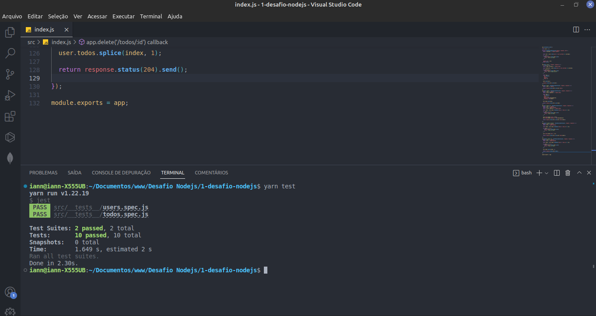

# Desafio 01 - Conceitos do Node.js

## :computer: Sobre o desafio

Essa será uma aplicação para gerenciar tarefas (em inglês *todo*). Será permitida a criação de um usuário com **name** e **username**, bem como fazer o CRUD de *todos*:

  - Criar um novo todo;
  - Listar todos os todos;
  - Alterar o title e deadline de um *todo* existente;
  - Marcar um *todo* como feito;
  - Excluir um *todo*;

## :camera: Screenshot

  <h3 align="center">Testes de usuário e de todos (tarefas)</h3>
  

